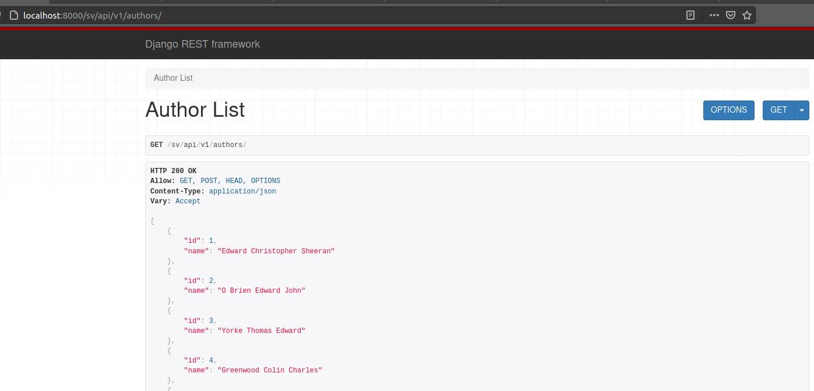

# Music Works Single View + REST API
## About
A Single View application aggregates and reconciles data from multiple
sources to create a single view of an entity, in this case, a musical work.

This is a test project.

Application creates the Works Single View from the metadata in works_metadata.csv file.
This implies parsing the input file, detecting duplicate musical works and storing reconciled
works in a PostgreSQL database.
Metadata from some sources may be incomplete, the aim of the Works
Single View is to have, for each musical work, the most complete
metadata without duplicates.

Works Single View REST API is a API simple API to query the Works Single View by
ISWC in order to get the metadata related to that work.

Technology stack:
 - Python3;
 - Django Framework;
 - Django REST framework;
 - PostgreSQL DB;
 - Docker (+ Docker compose)

 Designed by flurry <mailto:flurry.pa@gmail.com>

## Preview


## Build
### install from source
Make sure you've installed Python3 (version from 3.7), PostgresSQL DB, Docker. installed Python3 (version from 3.7), PostgresSQL DB, Docker.
#### 1. Create virtual environment and activate it.
```bash
python3 -m venv venv # or use which python find your python3 path
source venv/bin/activate
```
#### 2. Install requirements

```bash
pip3 install -r requirements.txt
``` 
#### 3. Run it 
Check in file env.dev:    
SQL_HOST=localhost

Run:
```bash
python3 manage.py runserver
```
Then visit

List of the music works:
http://localhost:8000/sv/api/v1/music_works/

List of the authors:
http://localhost:8000/sv/api/v1/authors/

## build by docker
#### 1. Check in file env.dev 
SQL_HOST=db

#### 2. Build 2 containers  and run from entrypoint.sh in detached mode
```bash
docker-compose up -d --build
```
#### 3.  Check working containers:
```bash
docker ps
```
#### 4. Choose web-container id  and go inside
```bash
docker exec -it e08c4a9775fd  sh
```
Here  e08c4a9775fd  is  web-container ID (as example). Change ID to yours.
#### 5. Run Django command (filling DB in working container)
```bash
python3 manage.py import_music_works works_metadata.csv
```
#### 6. Look in browser

List of the music works:
http://127.0.0.1:8000/sv/api/v1/music_works/

List of the authors:
http://127.0.0.1:8000/sv/api/v1/authors/

#### 7. To finish:
exit from working container:
```bash
exit
```